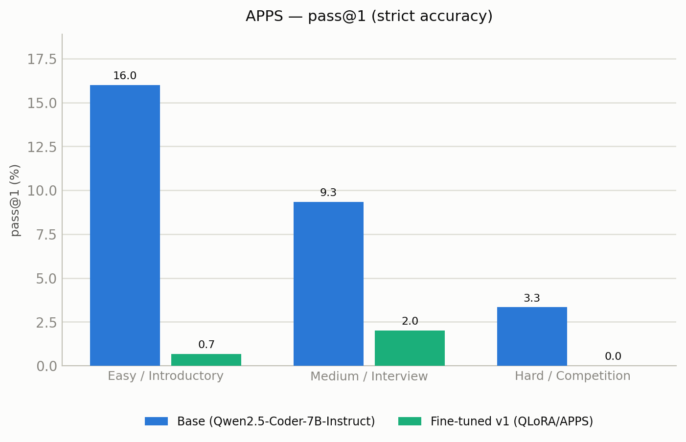
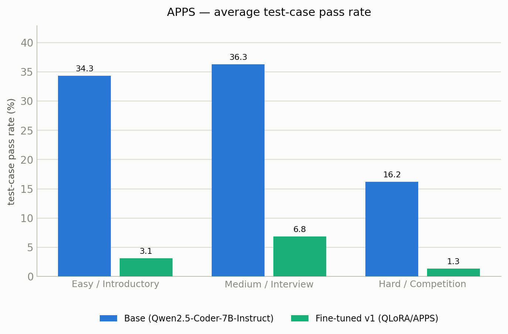

# Small Coding Model (SCM)

Fine-tuning **Qwen2.5-Coder-7B-Instruct** with **QLoRA** on the **APPS**
competitive-programming dataset, then measuring — with a difficulty-stratified,
execution-based **pass@1** evaluation — how the fine-tuned model compares to its
own un-tuned base checkpoint.

The purpose of the project is a rigorous, honest before/after measurement, not a claim of
state-of-the-art performance. As documented in the Results section below, the v1
fine-tune **regressed** relative to the base model; the evaluation was designed to
detect that outcome rather than assume an improvement, and the cause is analysed
in detail. Getting there also required finding and fixing an **evaluation-scoring
bug** in the third-party harness that initially masked the base model's true
ability (it reported 0 percent on easy problems the base actually solves ~16
percent of the time) — see "The evaluation-harness bug" below.

---

## Objective

Take a strong, already code-specialised 7B model and specialise it further on
competitive-programming problems using a memory-efficient fine-tuning method
(QLoRA), then quantify the effect against the base model on a held-out test set,
stratified by problem difficulty (introductory / interview / competition).

The framing is deliberately modest: frontier models score in the high-80s pass@1
on public leaderboards, and no LoRA adapter on a 7B model closes that gap at the
hard end. The defensible, interesting result lives in the before/after comparison
and in reporting transparently where the small model still fails.

---

## Resources

- **Fine-tuned model (merged 16-bit):**
  [Shaurya-saini/qwen2.5-coder-7b-apps-qlora](https://huggingface.co/Shaurya-saini/qwen2.5-coder-7b-apps-qlora)
- **Training notebook** (QLoRA fine-tune on Kaggle T4):
  [small-coding-model-v1-0](https://www.kaggle.com/code/shauryathemaster/small-coding-model-v1-0)
- **Model-upload notebook** (merge and push to the Hugging Face Hub):
  [scm-upload-hf](https://www.kaggle.com/code/shauryathemaster/scm-upload-hf)
- **Evaluation notebook** (bigcode-evaluation-harness on APPS):
  [scm-eval](https://www.kaggle.com/code/shauryathemaster/scm-eval)

---

## Approach

### Pipeline

The project is split into two deliberately isolated environments, because the
training and evaluation toolchains require conflicting library versions. The
Hugging Face Hub is the handoff point between them.

1. **Training (Kaggle, GPU T4 x2).** Load Qwen2.5-Coder-7B-Instruct in 4-bit via
   Unsloth, attach LoRA adapters, fine-tune on the APPS training split (problem to
   solution pairs), checkpoint regularly, and push the merged model and adapter to
   the Hub.
2. **Evaluation (separate clean environment).** Pull the base and fine-tuned
   models from the Hub and use bigcode-evaluation-harness to *generate* solutions
   on the held-out APPS test split. Scoring is then done by our own
   `eval/score_apps.py`, which executes each solution against the hidden tests and
   computes pass@1 per difficulty tier. (The harness's *own* APPS scorer was found
   to be broken for this setup and is no longer trusted — see "The
   evaluation-harness bug".)

### Key implementation decisions

| Decision | Reason |
|---|---|
| QLoRA rather than full fine-tuning | A 7B model in 16-bit needs roughly 28 GB; the free Kaggle T4 has 16 GB. QLoRA was a hardware requirement, not a preference. |
| 4-bit quantisation of the base model | Shrinks the base roughly fourfold so it fits in 16 GB. Evaluation is also performed in 4-bit for both models, which is the realistic way a 7B is deployed locally. |
| LoRA adapters (rank 16) | Only about 0.53 percent of the weights (40M of 7.66B) are trained; the rest stay frozen, keeping the base largely intact and the memory footprint small. |
| Base model: Qwen2.5-Coder-7B-Instruct | Already code-specialised and Apache-2.0 licensed. The goal was to sharpen an existing skill, not to teach coding from zero. |
| Train on the APPS training split only | The held-out APPS test split is reserved for evaluation; the two are never mixed. |
| Chat-templated evaluation prompt | The model was fine-tuned inside Qwen's chat template. Evaluating it on a bare prompt drove it off-distribution and produced systematically broken output; matching the training format for both models is what makes the comparison fair and correct. |
| pass@1 as strict accuracy, stratified by difficulty | The standard execution-based metric: generated code must actually run and pass all hidden tests. Splitting by tier shows exactly where the model wins and loses rather than hiding it in a single average. |
| 150 problems per tier | Chat-formatted generation costs several seconds per problem; the full 5,000-problem test set is impractical in a free session. A stratified subset gives a fair signal, with the sample size reported. |

### Evaluation methodology

Both models were evaluated identically: 4-bit weights, fp16 compute, single-sample
generation at temperature 0.2, and the same Qwen chat-template prompt. Generated
code was executed against APPS' hidden test cases. The reported **pass@1 is strict
accuracy** — a problem counts as solved only if every hidden test passes. A softer
secondary metric, the average fraction of individual test cases passed, is used for
additional resolution.

The numbers reported here were **re-scored** by `eval/score_apps.py` after the
original harness scorer was found to be broken. The re-scorer aligns each saved
generation to the correct problem (via the difficulty config), executes it against
the hidden tests with a whitespace-normalized comparison, and evaluates up to 25
tests per problem. The saved generations themselves were unchanged — only the
scoring was fixed.

---

## Results

Evaluated on the APPS held-out test split, 150 problems per difficulty tier. Two
complementary metrics are reported:

- **pass@1 (strict accuracy):** a problem counts as solved only if the generated
  code passes every hidden test. This is the headline, hardest-to-game metric.
- **Average test-case pass rate:** the mean fraction of individual hidden tests
  passed. It awards partial credit and therefore gives more resolution when strict
  pass@1 is near zero.

**The v1 QLoRA fine-tune underperformed the base model on every tier and under
both metrics** — but arriving at trustworthy numbers required fixing the
evaluation itself first.

> **Correction (2026-08-17).** The original v1 run used
> bigcode-evaluation-harness, whose APPS scorer was broken for this setup: it
> reported the base model at **0.0 percent** pass@1 on the easy and hard tiers for
> generations that are in fact ~16 and ~3 percent correct. The generations were
> fine — the harness's scoring/orchestration mis-aligned each solution against the
> wrong problem's tests and discarded valid answers. The numbers below are
> **re-scored** with `eval/score_apps.py`, a standalone, alignment-verified scorer
> that executes each saved solution against the correct hidden tests
> (whitespace-normalized, up to 25 tests per problem). The debugging trail is in
> `eval/diagnose_apps.py` and `V2_PROGRESS.md`.

### pass@1 (strict accuracy)

The base is a respectable coder whose accuracy falls monotonically with difficulty
— 16.0 percent on easy, 9.3 percent on medium, 3.3 percent on hard. The fine-tune
manages only 0.7, 2.0, and 0.0 percent respectively: it never leads on any tier.

### Average test-case pass rate

With partial credit the gap is stark and consistent: the base passes 34.3 / 36.3 /
16.2 percent of individual hidden tests across easy / medium / hard, versus
3.1 / 6.8 / 1.3 percent for the fine-tune. The fine-tune is not merely failing to
fully solve problems — it gets far fewer individual test cases right across the
board, because much of its output does not even compile.

Both tables and both figures are produced by `eval/build_results_table.py` from
`results/scores.json`; the full generated report is in
[`results/report.md`](./results/report.md), and raw per-tier metrics and
generations are under `results/apps/`.

---

## Observations and analysis

Inspecting the raw generations side by side made the cause of the regression
clear. Three factors, in order of importance:

1. **Training on the shortest solution per problem.** The data-preparation step
   selected the single shortest correct solution for each APPS problem. In APPS,
   the shortest solutions are heavily golfed, cryptic, competition-style code.
   Training a capable instruct model to imitate that style narrowed it: the
   fine-tune produces terse, cramped attempts where the base writes structured,
   commented, more-correct code. This is a data-selection issue, and it is the
   single largest contributor to the regression.
2. **Catastrophic forgetting.** Even a single epoch of imitation on 5,000
   stylistically-skewed examples was enough to erode the base model's broad coding
   ability in exchange for a narrow style that generalises worse to unseen
   problems.
3. **A learned syntax artifact.** The fine-tune acquired an over-eager
   closing-bracket tendency (for example `input().split()))` or `range(1, n+1)):`)
   from the densely-nested competitive code it was trained on. This produces
   outright compile errors on problems the base model handles correctly.

None of this is surprising in retrospect: fine-tuning a strong model on a narrow,
stylistically-skewed target is a well-understood way to regress it. The value of
v1 is a clean, rigorous measurement of that regression together with a precise
diagnosis of its cause.

---

## Conclusions

- QLoRA fine-tuning on this data and configuration did not improve the model; it
  degraded it. The un-tuned Qwen2.5-Coder-7B-Instruct is the stronger model on
  APPS across all three difficulty tiers and under both metrics (strict pass@1 and
  average test-case pass rate).
- The regression is attributable primarily to training on the shortest (golfed)
  solutions and to catastrophic forgetting, not to the QLoRA method itself.
- A trustworthy evaluation requires matching the evaluation prompt to the
  training prompt format; mismatches can masquerade as catastrophic model failure.
- **The benchmark harness can itself be the bug.** A capable base model scoring
  0 percent on *introductory* problems was the red flag that exposed a broken APPS
  scorer; the true base rate is ~16 percent. Validate the scorer (a known-good
  model should clear an easy tier) before trusting any comparison, and prefer a
  standalone, alignment-checked scorer over a fragile third-party harness.
- Reporting a negative result honestly, with a clear root-cause analysis, is a
  legitimate and informative outcome for this kind of study.

---

## Limitations and next steps (v2)

The v1 post-mortem points to a clear v2 direction. The full plan and live status
live in [`V2_PROGRESS.md`](./V2_PROGRESS.md); the essentials:

- **Train on reasoning traces, not golfed solutions.** The root cause of v1 was
  imitating the single *shortest* (golfed) APPS solution per problem. v2 keeps the
  same base (Qwen2.5-Coder-7B-Instruct, for a clean before/after) but fine-tunes on
  long chain-of-thought *reasoning traces* (e.g. the OpenCodeReasoning dataset,
  which took a 7B to ~51 percent on LiveCodeBench with SFT alone). The model learns
  *how to reason to a solution* rather than a terse code style.
- **Reduce forgetting:** lower learning rate (~1e-4), fewer steps, optionally mix
  in general instruction data; track a general-code sanity metric to prove no
  regression.
- **Fixed, broader evaluation:** re-use the corrected `eval/score_apps.py` on the
  same 150 problems per tier for a direct v1-to-v2 comparison, add a
  **HumanEval+/MBPP+ sanity bench** (also a forgetting guardrail), and make
  **LiveCodeBench** the headline for a contamination-free comparison against
  published frontier numbers. LiveCodeBench is never used for training.
- **Reinforcement learning (stretch):** the strongest competitive-programming
  models (e.g. DeepCoder-14B) are trained with RL on verifiable rewards — the code
  is rewarded only when it passes the tests. A small GRPO+QLoRA experiment is a
  possible didactic add-on, but a full RL run is out of scope for a single free GPU.
- **Scale:** evaluate on a larger subset (or the full test set) once throughput
  allows, and with full (uncapped) hidden-test scoring for the final numbers.

---

## Repository and reproduction

- `setup.md` — concise, step-by-step reproduction guide (data, training,
  evaluation).
- `requirements/` — pinned dependency lists for the data, training, and evaluation
  environments (kept separate by design).
- `data/`, `training/`, `eval/`, `results/` — the pipeline scripts and outputs.
