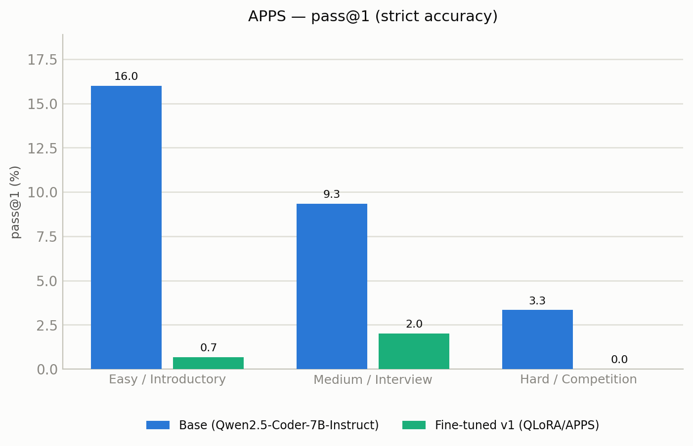

# Results — difficulty-stratified evaluation

APPS held-out **test** split, 150 problems per difficulty tier. Both models: 4-bit, single-sample (greedy, temp 0.2), prompted with the SAME Qwen chat template the fine-tune was trained in (fair comparison). **These numbers are RE-SCORED by `eval/score_apps.py`.** The original v1 run used bigcode-evaluation-harness, whose APPS scorer was broken for this setup — it reported 0.0% on introductory for base generations that are actually ~16% correct (the generations were fine; the harness's scoring/orchestration mis-aligned and threw them away). Scoring here is alignment-verified (difficulty config), executes each solution against the hidden tests, and is whitespace-normalized; metrics are computed over up to 25 hidden tests per problem (a small over-count vs. the full suite). Two metrics: **pass@1** = strict accuracy (ALL tested hidden tests pass) and **average test-case pass rate** = mean fraction of hidden tests passed (partial credit). Corrected finding: the un-tuned base is a respectable coder (16.0 / 9.3 / 3.3 pass@1, now correctly monotonic easy→hard), and the v1 QLoRA fine-tune — trained on the single *shortest* (golfed) APPS solution per problem, 1 epoch — **still underperformed the base on every tier and both metrics**, largely due to a learned broken-syntax (extra-closing-bracket) artifact. See README.md for analysis and the v2 plan.

### APPS — pass@1 (strict accuracy)

| Difficulty | Base (Qwen2.5-Coder-7B-Instruct) | Fine-tuned v1 (QLoRA/APPS) |
|---|---|---|
| Easy / Introductory | pass@1 16.0 | pass@1 0.7 |
| Medium / Interview | pass@1 9.3 | pass@1 2.0 |
| Hard / Competition | pass@1 3.3 | pass@1 0.0 |

_Problems per tier — Easy / Introductory: 150, Medium / Interview: 150, Hard / Competition: 150._

### APPS — average test-case pass rate

| Difficulty | Base (Qwen2.5-Coder-7B-Instruct) | Fine-tuned v1 (QLoRA/APPS) |
|---|---|---|
| Easy / Introductory | 34.3 | 3.1 |
| Medium / Interview | 36.3 | 6.8 |
| Hard / Competition | 16.2 | 1.3 |

_Problems per tier — Easy / Introductory: 150, Medium / Interview: 150, Hard / Competition: 150._

---

**Honesty notes:**
- Only cells sourced from our own eval pipeline are unmarked; *(cited)* cells are published leaderboard numbers for the same split.
- The hard/competition-tier gap is reported as-is, not downplayed.
- Our 7B is evaluated **4-bit quantized** (base and fine-tuned identically), the realistic local-deploy setting; frontier numbers are full-precision API.
- pass@k settings (k, samples, temperature, precision) are recorded per run in the `results/apps/` and `results/livecodebench/` metrics files.
